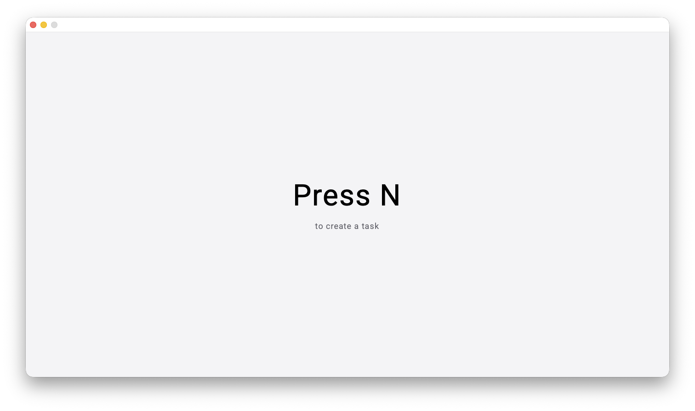
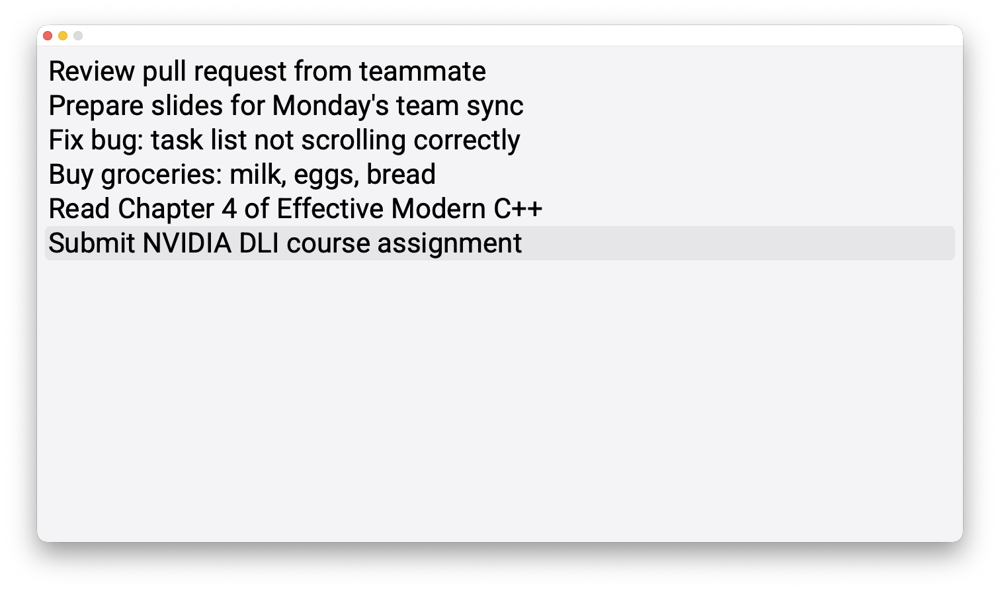
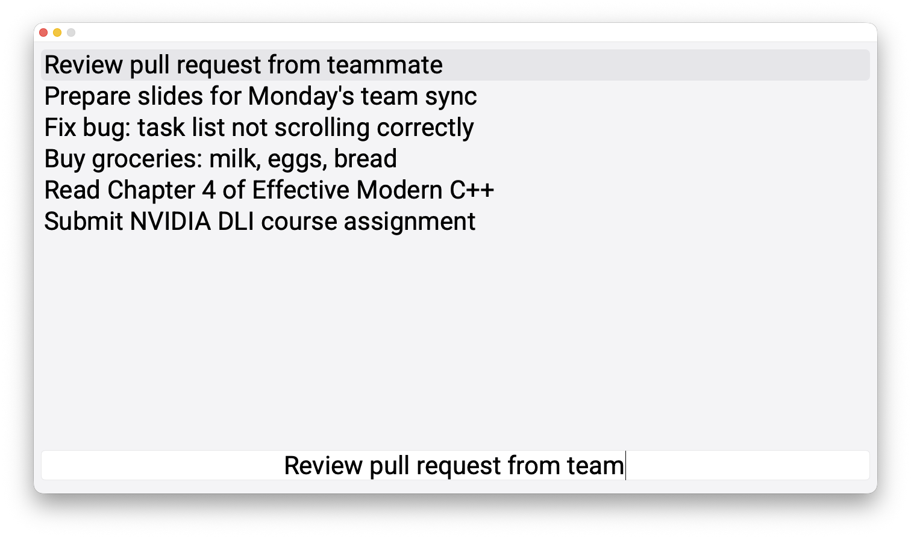
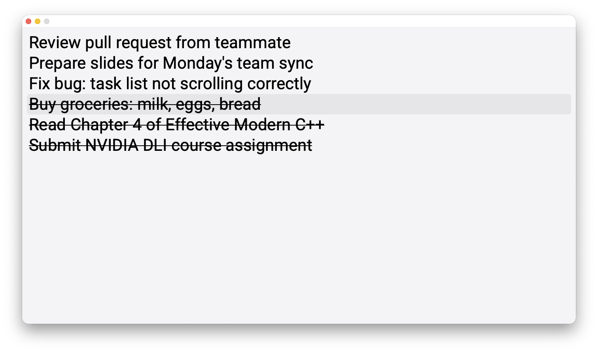
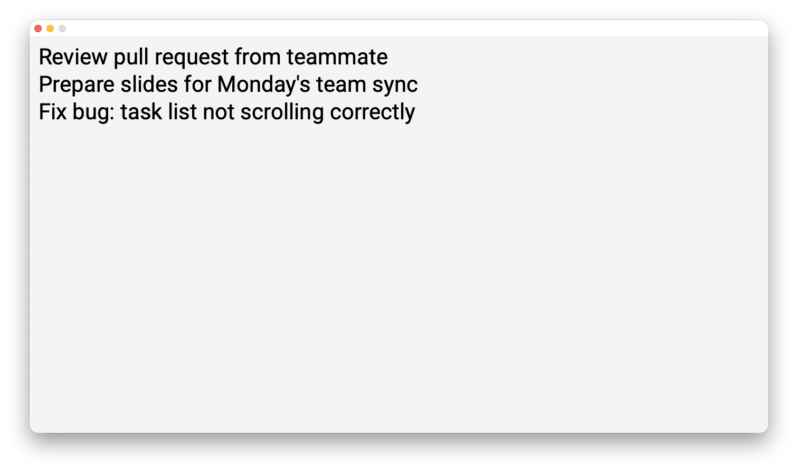

# todoApp-qt-cpp


A minimalist, keyboard-driven to-do app built with C++ and Qt 6. No mouse. No clutter. Just tasks.
## Overview
todoApp is a desktop productivity tool designed around a single principle: your hands never leave the keyboard. Built as a personal project to learn C++ and Qt simultaneously.

## Screenshots

<table>
  <tr>
    <td></td>
    <td></td>
  </tr>
  <tr>
    <td align="center">Empty state</td>
    <td align="center">Task list</td>
  </tr>
  <tr>
    <td></td>
    <td></td>
  </tr>
  <tr>
    <td align="center">Inline editing</td>
    <td align="center">Completed tasks (strikethrough)</td>
  </tr>
  <tr>
    <td colspan="2" align="center"></td>
  </tr>
  <tr>
    <td colspan="2" align="center">Completed tasks hidden</td>
  </tr>
</table>

## Features
- Full keyboard navigation — zero mouse required
- Tasks persist between sessions via JSON
- Inline editing with live text input
- Strikethrough toggle for completed tasks
- Hide / show completed tasks
- Task reordering via keyboard
- Clean off-white UI with QSS styling
- Custom Roboto font embedded via Qt resources
## Keyboard Shortcuts
| Key | Action |
|-----|--------|
| `N` | Create new task |
| `Enter` | Confirm / save task |
| `Esc` | Cancel input |
| `↑` / `↓` | Navigate tasks (circular) |
| `Cmd+↑` / `Cmd+↓` | Move task up / down |
| `Space` | Toggle complete (strikethrough) |
| `E` | Edit selected task |
| `D` | Delete selected task |
| `H` | Hide / show completed tasks |
## Download
Grab the latest `.dmg` from [Releases](https://github.com/ohiiartem/todoApp-qt-cpp/releases) — no Qt installation required.
## Tech Stack
| | |
|---|---|
| Language | C++17 |
| Framework | Qt 6 |
| Build system | CMake |
| Storage | JSON |
| Styles | QSS (Qt Style Sheets) |
| Testing | GoogleTest + CTest |
| CI | GitHub Actions (build + tests on Ubuntu) |
## Architecture
The app is split so that the task logic does not depend on the interface:

- **`Task`** — a single task; guarantees its text is never empty or padded.
- **`TaskManager`** — owns the task list and its JSON persistence. Links against
  `Qt6::Core` only, which is what makes it testable without a GUI.
- **`AppStateMachine`** — owns which screen the app is in (empty / creating a
  task / browsing the list) and the transitions between those states.
- **`MainWindow`** — builds the widgets, turns key presses into intents for the
  two classes above, and redraws the list from the model.

Data flows one way: the model changes, then the widget is rebuilt from it.
## Building from Source
**Requirements**
- Qt 6.x
- CMake 3.21+
- Qt Creator (recommended) or any C++ build environment with CMake

**Steps**

```bash
git clone https://github.com/ohiiartem/todoApp-qt-cpp.git
cd todoApp-qt-cpp
mkdir build && cd build
cmake .. -DCMAKE_PREFIX_PATH=/path/to/your/Qt/6.x.x/macos
cmake --build .
```

Or open `CMakeLists.txt` directly in Qt Creator (`File → Open File or Project...`) and press `Cmd+B` (macOS) or `Ctrl+B` (Windows/Linux).
> Replace `CMAKE_PREFIX_PATH` with your local Qt install path (e.g. `~/Qt/6.x.x/macos` if installed via the Qt Online Installer, or `$(brew --prefix qt)` if installed via Homebrew).

**Running the tests**

```bash
ctest --output-on-failure
```

GoogleTest is fetched automatically during configuration, so the first build needs an internet connection. Pass `-DTODOAPP_BUILD_TESTS=OFF` to skip the tests and build the app alone.

## Data Storage
Tasks are saved automatically after every action (create, edit, delete, toggle). No manual save needed.
- **macOS:** `~/Library/Application Support/To Do/tasks.json`
- **Windows:** `%APPDATA%\To Do\tasks.json`
```json
{
  "tasks": [
    { "text": "Buy milk", "completed": false },
    { "text": "Finish homework", "completed": true }
  ]
}
```
## Project Structure

```
todoApp-qt-cpp/
├── CMakeLists.txt          # Build configuration
├── .github/workflows/      # CI: build + tests on every push and pull request
├── main.cpp                # Entry point, loads font & QSS
├── mainwindow.h/.cpp       # Widgets, keyboard handling, rendering the list
├── AppStateMachine.h/.cpp  # App states and the transitions between them
├── taskmanager.h/.cpp      # Owns the task list, JSON persistence
├── task.h/.cpp             # A single task: text + completed flag
├── tests/                  # GoogleTest unit tests for the model
├── style.qss               # App-wide styles
├── resources.qrc           # Embedded fonts & styles
└── fonts/
    └── Roboto-Regular.ttf
```
## Status
**v1.5** — keyboard shortcuts complete, standalone `.dmg` available.

Since then the model has been separated from the interface, the core logic moved into its own library, and unit tests and CI were added.

Planned:
- Undo / redo for task operations
- Task priorities (High / Medium / Low)
- Updated UI / UX
## About
Built by **@ohiiartem** as a learning project — C++ and Qt from scratch.
